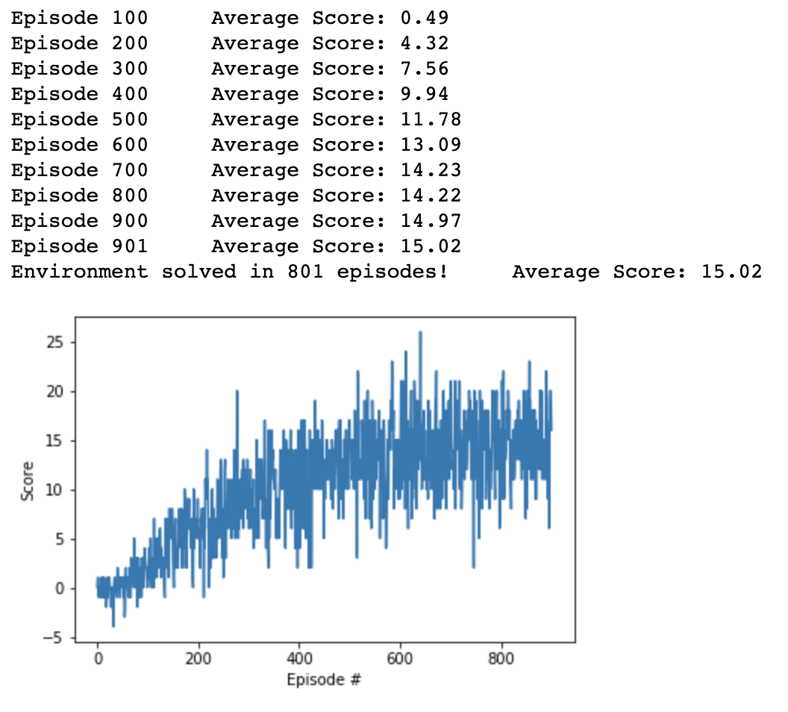
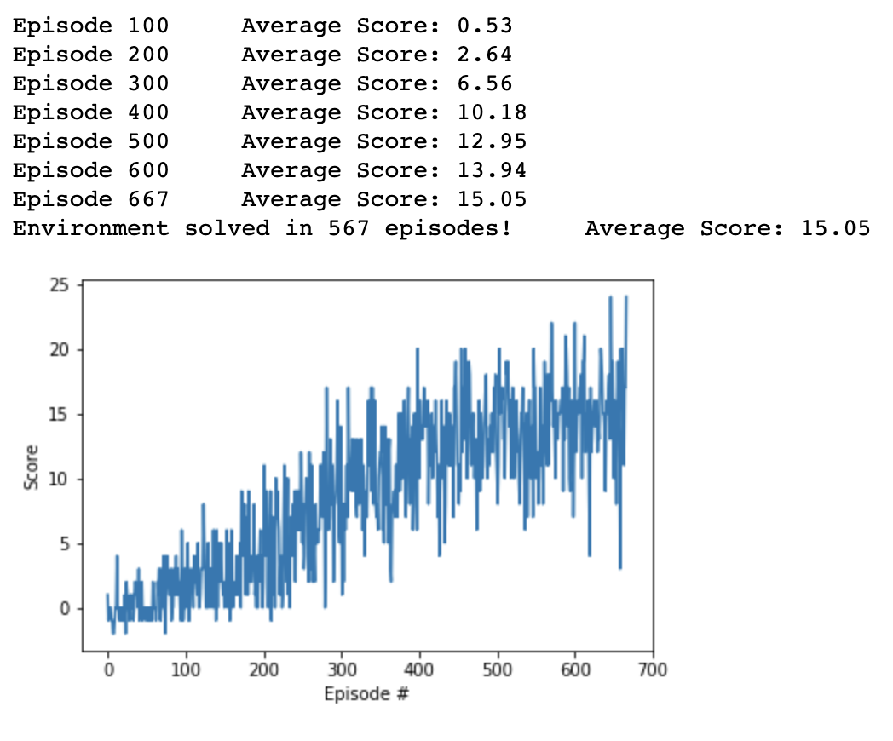

# Personal Report
## Learning Algorithm
This section decribes learning algorithms and hyperparameters.

### 1. [Deep Q-Learning](https://www.cs.toronto.edu/~vmnih/docs/dqn.pdf)
The DQN tries to approximate action-value function using Deep Neural Networks. Although many previous works have tried this, it was unstable. Mnih *et al* tackles this problem using two key ideas: *Replay Memory* and *Fixed Q-Targets*.
The replay memory tries to break correlation between successive states and actions. The method stores <S, A, R, S'> in memory buffer, and randomly samples training data from this buffer.
The Fixed Q-Targets decouples weights for evaluating expected values(*target values*) and weights for evaluating action-values. This decoupling prevents oscillation of action-values.
The Fixed Q-Targets implmented by using extra target network. The network is updated using weights ensembling:  

`θ_target = τ*θ_local + (1 - τ)*θ_target`. 

### 2. [Double DQN](https://arxiv.org/pdf/1509.06461.pdf)
Double DQN tries to handle the problem of overestimation of values that frequently appears in Vanilla DQN. The method simply seperates a network that chooses actions from a network that evaluate the values of the actions. 

## Implementation Details
### Model and Hyperparameters
* Fully Connected Network with two hidden layers that has 128 hidden units.
* Hyperparameters (Both algorithms are trained on same hyperparameters)
    * 'BUFFER_SIZE': int(1e5),  # replay buffer size
    * 'BATCH_SIZE': 64,         # minibatch size
    * 'GAMMA': 0.99,            # discount factor
    * 'TAU': 1e-3,              # for soft update of target parameters
    * 'LR': 5e-4,               # learning rate 
    * 'UPDATE_EVERY': 4,        # how often to update the network
    * 'SEED': 0,
    * 'N_EPISODES': 2000,
    * 'MAX_TIME_STEP': 1000,
    * 'EPS_DECAY': 0.995

## Plot of rewards
### 1. DQN

### 2. Double DQN

Both algorithms received reward +15 averaged over 100 consecutive episodes.
But, Double DQN is slightly faster to get there.

## Ideas for future work
It might be helpful to implement Prioritized Replay Memory or Dueling DQN
