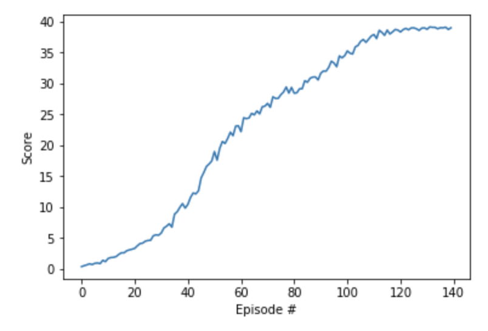

# Reviews on PPO

## 1. Implemented Algorithm
Implemeted algorithm was [Proximal Policy Optimization](https://arxiv.org/abs/1707.06347) which is widely used for continous action tasks. 

The algorithm tries to optimize policy while not tries to violate its assumption.

To implement this algorithm, we should implement [GAE](https://arxiv.org/abs/1506.02438) for calculating advantages and [Clipped Surrogate](https://arxiv.org/abs/1707.06347).

## 2. Model
Model was chosen according to PPO paper which is using two fully connected layers with 64 units for each layer. However, Swish function was used for activation function instead of tanh function. And Actor-Critic model with shared parameters has been used for more faster converge. 

## 3. Hyperparameters
* **Max epoch:** 250
* **decay factor(gamma):** 0.99
* **GAE lambda:** 0.95
* **Max trajectory length:** 2018
* **Learning rate:** 0.001
* **PPO epsilon:** 0.1
* **PPO epoch:** 10
* **PPO batch size:** 128
* **Emtropy weight:** 0.01

## 4. Results
As we can see below, It only took 80 epoches to get to episode score **+30**.
And Moving average took around 140 epoches. 

## 5. Ideas for Future Work
Maybe this [work](https://pdfs.semanticscholar.org/e70f/515be612a8da557c75bd5de1afc9f2bebb7f.pdf?_ga=2.109847429.1285743693.1556534738-1432602229.1542559453) could be helpful. This work tries to reduce variance issue on policy gradient estimation. Or ensemble with other works like DDPG may be helpful, too.

