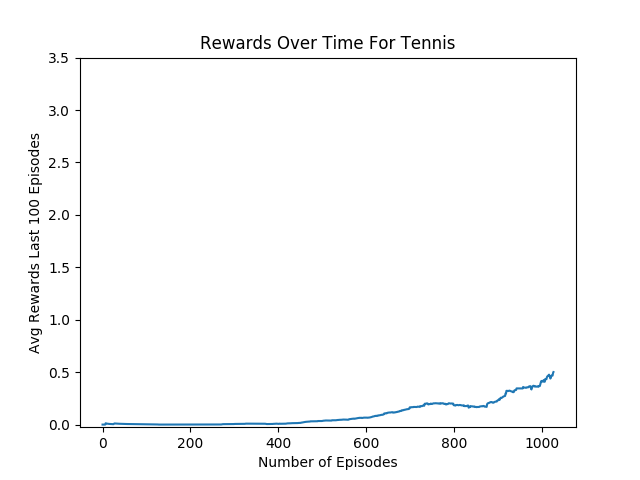
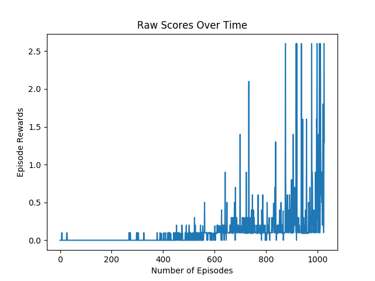

# Personal Report

This personal report for my implementation of the MADDPG.

## 1. Learning Algorithm
The implemented algorithm is [MADDPG](https://arxiv.org/abs/1706.02275) which is pusblished by  OpenAI. The algorithm is extension of DDPG algorithm to apply multi-agent environments.
The algorithm is based on *the framework of centralized training with decentralized execution* which is using extra information on training that cannot be used on execution.
Critic of the algorithm uses all agents' information (states and actions). But Actors only uses its own agent's information. On execution, only actors are used.


## 2. Hyperparamters
```python
options = {
    'MAX_EPOCHES': 10000,
    'GAMMA': 0.95,
    'EPISODE_SIZE': 10000,
    'TAU': 0.02,
    'BATCH_SIZE': 128,
    'EPISODE_PER_UPDATE': 2,
    'PRINT_PERIOD': 5,
    'CKPT': 'model.pth',
    'SEED': 96170,
    'NOISE': 1.0,
    'NOISE_REDUCTION': 0.9999
}
```
These are my hyperparameters. This algorithm is very hyperparameter sensitive and hard to reproduce. Especially, it depends hardly on random seed. It is also highly sensitive to network parameters and floating point errors.

## 3. Models
The used actor model is fully-connected network with 4 hidden layers that consist 256, 128, 128, 64 units, repectively. And the critic model is also fully-connected network as same shape as the actor model.

## 4. Results
The below image is average rewards of last 100 episodes.


The below image is raw rewards of episodes.


It tooks around 1080 episodes to get +0.5.

## 5. Future works
[prioritized experience replay](https://arxiv.org/abs/1511.05952) should be helpful.
Or maybe we can use advantages to stable learning.